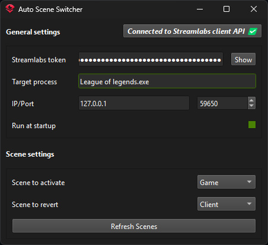

# AutoSceneSwitcher

Switch Streamlabs scene based on process presence

## Requirements

- [Microsoft Visual C++ Redistributable](https://aka.ms/vs/17/release/vc_redist.x64.exe)

## Download

You can grab latest release [here](https://github.com/Odizinne/AutoSceneSwitcher/releases/latest).

## Configuration

- Get your streamlabs token:

Go to streamlabs settings -> remote control -> click on the QR code -> click show details
Copy the API token and paste it inside `Streamlabs token`

- Set target process

Type the process name you're looking for to automate scene switch
Ex: `League of legends.exe`

- Set IP/Port

In most case you should not modify them.  
Only useful if you're running Streamlabs and AutoSceneSwitcher on different devices.  

Defaults:  
`IP`: 127.0.0.1  
`port`: 59650

- Set your scenes

`Scene to activate`: This scene will be set as active when process is found.  
`Scene to revert`: this scene will be set as active when process is no more found.

Type the exact scene name.

You're good to go.

You can close the window, AutoSceneSwitcher will run in the background.
